# Dockerized Playwright Automation


[](https://jhrahman.github.io/dockerized-playwright-project/)

A clean Playwright automation setup with Docker support for reliable local and CI execution.

## Contents

- [About](#about)
- [Quick Start](#quick-start)
- [Docker Setup](#docker-setup)
- [Docker Compose](#docker-compose)
- [CI / CD](#ci--cd)
- [Published Reports](#published-reports)
- [Project Structure](#project-structure)
- [Commands](#commands)
- [Notes](#notes)
- [Troubleshooting & Useful Links](#troubleshooting--useful-links)

## About

This repository uses Playwright for browser automation and Docker to make the runtime reproducible. It is built so the same configuration works locally and in CI.

---



## Quick Start

### Local setup

1. Install dependencies:
   ```bash
   npm install
   ```
2. Install Playwright browsers:
   ```bash
   npx playwright install --with-deps
   ```
3. Run the automation:
   ```bash
   npx playwright test
   ```

### When to use Docker

Use Docker when you want a consistent environment across machines, or when you want to mirror CI behavior locally.

## Docker Setup

Docker packages the application together with the OS, Node.js, Playwright, and dependencies.

### Why two Dockerfiles?

- `Dockerfile.ci` is intended for CI.
  - Uses the Playwright base image
  - Installs dependencies, Java runtime, and the Allure CLI
  - Copies the source and runs `npx playwright test`
  - Optimized for reproducible test execution and GitHub Actions report publishing
- `Dockerfile.dev` is intended for local development.
  - Uses the same Playwright base image as CI
  - Installs project dependencies with `npm ci`
  - Copies the source and keeps the container running with `tail -f /dev/null`
  - Enables interactive local development using a mounted workspace
- `docker-compose.yml` builds the local container from `Dockerfile.dev` and mounts the host project into `/app`.
  - This keeps local development fast and makes it easy to run commands inside the dev container without rebuilding.

### Common Docker commands

- Build the CI image:
  ```bash
  docker build -f Dockerfile.ci -t playwright-test-image .
  ```
- Run the image:
  ```bash
  docker run --rm \
    -v "${PWD}/playwright-report:/app/playwright-report" \
    -v "${PWD}/test-results:/app/test-results" \
    playwright-test-image
  ```
- List running containers:
  ```bash
  docker ps
  ```
- Remove an image:
  ```bash
  docker rmi playwright-test-image
  ```

## Docker Compose

Docker Compose makes it easier to manage the local development container.

### What `docker-compose.yml` does

- Builds the image from `Dockerfile.dev`
- Starts the development container
- Mounts the project folder into `/app`
- Keeps the container running until stopped

### Common Docker Compose commands

- Build and start services:
  ```bash
  docker compose up -d
  ```
- Stop and remove all services:
  ```bash
  docker compose down
  ```
- Stop services without removing them:
  ```bash
  docker compose stop
  ```
- Start previously stopped services:
  ```bash
  docker compose start
  ```
- Show Compose-managed containers:
  ```bash
  docker compose ps
  ```
- View service logs:
  ```bash
  docker compose logs
  ```
- Execute a command inside a running service:
  ```bash
  docker compose exec playwright <command>
  ```

### Rule of thumb

- Use Docker for individual image builds and container runs.
- Use Docker Compose to manage services and simplify local development.

## CI / CD

A GitHub Actions workflow is included at `.github/workflows/playwright.yml`.

The pipeline:

- checks out the repository
- builds the CI Docker image using `Dockerfile.ci`
- runs Playwright tests inside the container
- uploads HTML report and test artifacts
- publishes the generated Allure report to GitHub Pages at `https://jhrahman.github.io/dockerized-playwright-project/`

Use `CI=true` in CI environments to enable Playwright CI behavior.

## Published Reports

The latest generated Allure report is published automatically to GitHub Pages:

- Allure report: https://jhrahman.github.io/dockerized-playwright-project/

This provides a live, shareable test report for every run.

## Project Structure

```text
dockerized-test/
├── .github/
│   └── workflows/playwright.yml    # CI workflow and GitHub Pages deployment
├── pages/                          # Page objects and reusable UI helpers
├── tests/                          # Playwright test suites and scenarios
├── utils/                          # Shared helpers, fixtures, and test data utilities
├── allure-results/                 # Raw Allure test results generated by CI/local runs
├── allure-report/                  # Generated Allure HTML report output
├── docker-compose.yml              # Local development Docker Compose config
├── Dockerfile.dev                  # Local development Docker image recipe
├── Dockerfile.ci                   # CI Docker image recipe for Playwright and Allure
├── playwright.config.ts            # Playwright runner and project configuration
└── README.md                       # Project overview and usage guide
```

## Commands

- Run the full suite locally:
  ```bash
  npx playwright test
  ```
- Run a specific browser project:
  ```bash
  npx playwright test --project=chromium
  ```
- Open the HTML report:
  ```bash
  npx playwright show-report
  ```
- Start local development container:
  ```bash
  docker compose up -d
  ```
- Execute tests inside the running dev container:
  ```bash
  docker compose exec playwright npx playwright test
  ```
- Stop and remove local container:
  ```bash
  docker compose down
  ```

## Notes

- The Docker setup is based on the official Playwright image (`mcr.microsoft.com/playwright:v1.61.1-noble`).
- `Dockerfile.ci` is used for CI execution and Allure report generation.
- `Dockerfile.dev` is used for local development and keeps the container running for interactive use.
- The project captures screenshots, video, and trace on failure.
- CI publishes the generated Allure report automatically to GitHub Pages.

## Troubleshooting & Useful Links

### Troubleshooting

- If tests fail on CI, check the generated HTML and Allure reports in the workflow artifacts.
- If Playwright browsers are missing, run:
  ```bash
  npx playwright install --with-deps
  ```
- If the local container gets stuck, rebuild and restart with:
  ```bash
  docker compose down && docker compose up --build -d
  ```
- If reports are not generating, verify that `allure-results/` is populated before running report generation.

### Useful Links

- Allure report: https://jhrahman.github.io/dockerized-playwright-project/
- GitHub Actions workflow: `.github/workflows/playwright.yml`
- Playwright docs: https://playwright.dev
- Docker Compose docs: https://docs.docker.com/compose/

